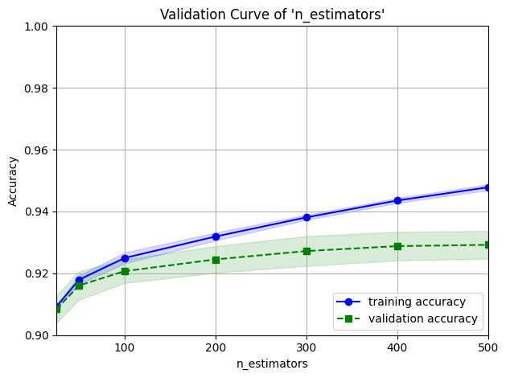
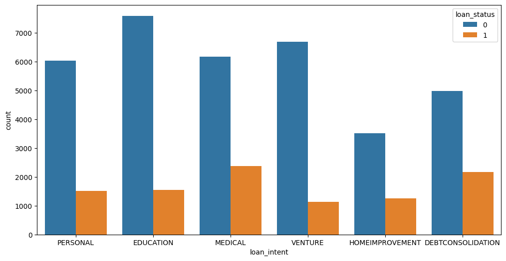
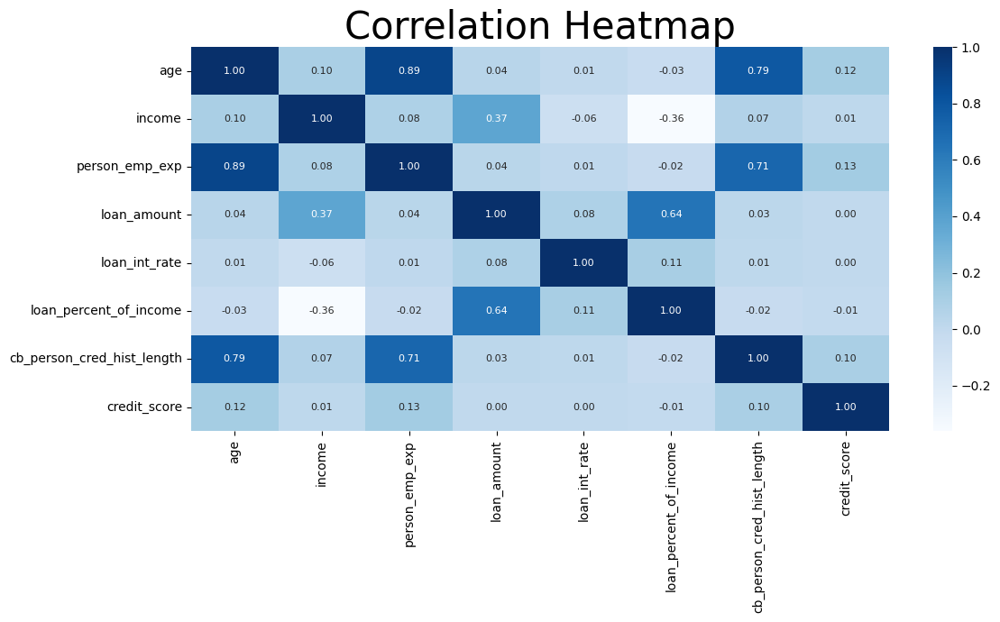

# Credit Risk Classification System: Loan Approval Prediction

Predicts whether a loan application is approved or rejected from applicant and loan attributes. A **Gradient Boosting** model tuned with **Optuna** reaches **93.3% accuracy**, **0.908 precision**, **0.877 recall** and **0.892 F1** on **45,000 loan records**, compared with about 78% accuracy for a model that always predicts "rejected".

## Dataset

45,000 loan applications, 14 columns, target `loan_status` (1 = approved, 0 = rejected). Roughly **22% of loans are approved**, so the classes are imbalanced and recall on the approved class matters as much as accuracy.

| Group | Columns |
|-------|---------|
| Demographics | `age`, `gender`, `education` |
| Financial | `income`, `person_emp_exp`, `home_ownership` |
| Loan | `loan_amount`, `loan_intent`, `loan_int_rate`, `loan_percent_of_income` |
| Credit profile | `credit_score`, `cb_person_cred_hist_length`, `previous_loan_defaults_on_file` |

Composition highlights: 54% of applicants rent and 39% have a mortgage, 52% have a previous default on file, and loan intent is spread across education (21%), medical (19%), venture (17%), personal (16%), debt consolidation (16%) and home improvement (10%).

## Approach

1. **Exploration:** distributions, correlations and approval patterns by loan intent, income and default history.
2. **Preprocessing:** categorical features encoded (one-hot for `home_ownership` and `loan_intent`, ordinal for `education`), numeric features standardized.
3. **Model comparison:** Gradient Boosting, AdaBoost, Random Forest, XGBoost and SVM evaluated on accuracy and recall, including behavior as training data grows.
4. **Tuning:** Optuna search over `n_estimators`, `learning_rate` and `max_depth` for Gradient Boosting.
5. **Diagnostics:** validation curve on `n_estimators` and feature importance.

## Results

### Final model

| Model | Precision | Recall | F1 | Accuracy |
|-------|-----------|--------|-----|----------|
| **Gradient Boosting + Optuna** | **0.908** | **0.877** | **0.892** | **0.933** |

Best hyperparameters: `n_estimators=310`, `learning_rate=0.225`, `max_depth=5`.

### Model comparison (test set, full training data)

| Model | Accuracy | Recall |
|-------|----------|--------|
| **Gradient Boosting (tuned)** | **0.933** | **0.877** |
| XGBoost | 0.932 | 0.874 |
| Random Forest | 0.928 | 0.856 |
| Gradient Boosting (default) | 0.923 | 0.851 |
| SVM | 0.915 | 0.844 |
| AdaBoost | 0.896 | 0.845 |

Tuning improved default Gradient Boosting by about 1 point of accuracy and 2.6 points of recall. XGBoost with default settings is already within 0.1 points of the tuned model, so the top three tree ensembles are close and the choice between them is small.

### Validation curve



Validation accuracy climbs quickly up to roughly 100 trees and flattens around **0.93** beyond about 300, while training accuracy keeps rising toward 0.95. Past that point, extra trees add overfitting rather than performance, which is consistent with the tuned value of 310.

### Feature importance

| Rank | Feature | Importance |
|------|---------|-----------|
| 1 | `previous_loan_defaults_on_file` | 0.228 |
| 2 | `loan_int_rate` | 0.167 |
| 3 | `loan_percent_of_income` | 0.152 |
| 4 | `income` | 0.131 |
| 5 | `credit_score` | 0.055 |
| 6 | `loan_amount` | 0.053 |

Prior defaults, interest rate, loan burden relative to income, and income drive most of the model's decisions. Credit score ranks lower than expected.

## Key Findings

- **Loan intent shapes approval rates.** Debt consolidation (about 30%) and medical (about 28%) loans are approved most often, while venture (about 14%) and education (about 17%) are approved least.



- **Some features overlap heavily.** Employment experience and credit history length correlate at **0.82**, and loan amount and loan percent of income at **0.59**. Neither pair hurts tree-based models much, but it matters for any linear model.



- **Overfitting varies by model.** Random Forest, AdaBoost and XGBoost reach near-perfect training accuracy, while their test accuracy sits between 0.90 and 0.93. The Gradient Boosting and SVM training scores are much closer to their test scores.

## Repository Structure

```text
Credit-Risk-Classification-System_ML/
├── loan_data_analysis_prediction.ipynb
├── loan_data.xlsx
├── images/
│   ├── validation_curve.png
│   ├── loan_intent_distribution.png
│   └── correlation_heatmap.png
└── README.md
```

## How to Run

```bash
git clone https://github.com/ShahadAljnidi/Credit-Risk-Classification-System_ML.git
cd Credit-Risk-Classification-System_ML
python -m venv venv
source venv/bin/activate        # Windows: venv\Scripts\activate
pip install pandas numpy matplotlib seaborn scikit-learn xgboost optuna scipy openpyxl
jupyter notebook loan_data_analysis_prediction.ipynb
```

## Limitations and Next Steps

- Handle the class imbalance explicitly (class weights or SMOTE) and report ROC-AUC and a confusion matrix.
- Add a calibrated probability output, since credit decisions usually need risk scores rather than hard labels.
- Save the final model with `joblib` and serve it through an API.
