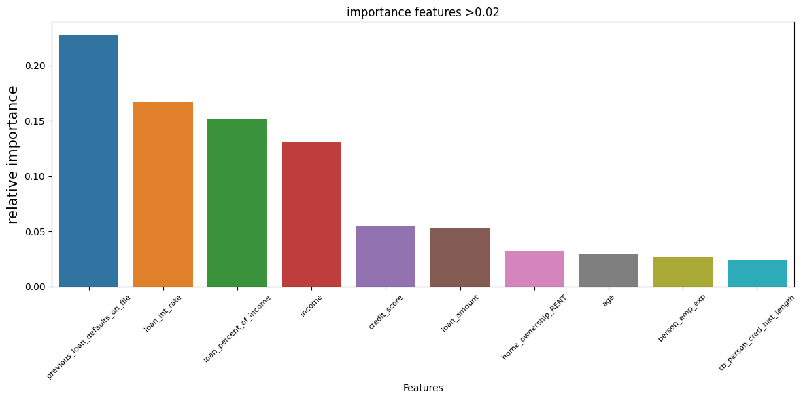

# Credit Risk Classification System: Loan Approval Prediction

Predicts whether a loan is approved or rejected from applicant and loan attributes. A **Gradient Boosting** model tuned with **Optuna** reaches **93.3% test accuracy** and **0.892 macro F1** on a cleaned dataset of **36,065 loans** (from 45,000 raw records), using a held-out test set of 7,213 loans. For reference, always predicting the majority class scores 77.8% on the full 45,000 rows.

## Dataset

45,000 loan records with 14 columns and a binary target, `loan_status` (1 = approved, 0 = rejected). Only **22.2%** of loans (10,000) are approved, so the classes are imbalanced.

| Group | Columns |
|-------|---------|
| Demographics | `age`, `gender`, `education` |
| Financial | `income`, `person_emp_exp`, `home_ownership` |
| Loan | `loan_amount`, `loan_intent`, `loan_int_rate`, `loan_percent_of_income` |
| Credit profile | `credit_score`, `cb_person_cred_hist_length`, `previous_loan_defaults_on_file` |

There are no missing values, but the raw data contains impossible entries (age up to 144, employment experience up to 125 years, income up to 7.2 million), which is why cleaning was a major step.

## Approach

1. **Cleaning:** removed outliers with the IQR rule across all 8 numeric features, leaving **36,065 of 45,000 rows (80.1%)**. Income skewness dropped from 34.1 to 0.73 and age kurtosis from 18.6 to about 0.
2. **Split:** 80/20 train-test split (28,852 training and 7,213 test rows).
3. **Encoding and scaling:** ordinal encoding for `education` (Master and Doctorate merged, since Doctorate is only 1% of rows), label encoding for `gender` and prior defaults, one-hot encoding for `home_ownership` and `loan_intent`, and standardization of numeric features fitted on the training set only.
4. **Model comparison:** Gradient Boosting, AdaBoost, Random Forest, XGBoost and SVM with default settings, trained on 1% up to 100% of the training data to see how each scales.
5. **Tuning:** Optuna with 20 trials and 5-fold cross-validation on the training set only, optimizing accuracy. It searched `n_estimators` (260 to 340) and `learning_rate` (0.15 to 0.25) with `max_depth` fixed at 5, in a narrow range around the point where the validation curve flattens.
6. **Diagnostics:** validation curve on `n_estimators` and Random Forest feature importance.

## Results

### Final model (test set)

| Model | Precision | Recall | F1 | Accuracy |
|-------|-----------|--------|-----|----------|
| **Gradient Boosting + Optuna** | **0.908** | **0.877** | **0.892** | **0.933** |

Precision, recall and F1 are macro-averaged over both classes. Best hyperparameters: `n_estimators=310`, `learning_rate=0.225`, `max_depth=5`. Best 5-fold cross-validation accuracy on the training set was 93.0%.

### Model comparison (test set, full training data)

| Model | Accuracy | Macro recall |
|-------|----------|--------------|
| **Gradient Boosting (tuned)** | **0.933** | **0.877** |
| XGBoost (default) | 0.932 | 0.874 |
| Random Forest (default) | 0.928 | 0.856 |
| Gradient Boosting (default) | 0.923 | 0.851 |
| SVM (default) | 0.915 | 0.844 |
| AdaBoost (default) | 0.896 | 0.845 |

Tuning lifted default Gradient Boosting by about 1 point of accuracy and 2.6 points of macro recall. Default XGBoost is within 0.1 points of accuracy of the tuned model, so the top tree ensembles perform very similarly on this data.

### Validation curve


For Gradient Boosting with default depth, validation accuracy rises quickly to about 100 trees and flattens near **0.93** beyond roughly 300, while training accuracy keeps climbing toward 0.95. More trees past that point add overfitting, not performance.

### Feature importance (Random Forest)



Prior defaults (0.228), interest rate (0.167), loan percent of income (0.152) and income (0.131) account for most of the model's signal. Credit score (0.055) ranks lower than the four financial-burden features.

## Key Findings

- **Income is strongly linked to approval.** The approval rate falls steadily across income quartiles: **40.4%** (lowest), 22.1%, 17.2% and **9.3%** (highest), more than a 4x gap. This is the opposite of what real lending usually shows, so treat it as a pattern in this dataset, not a general rule.
- **Loan intent matters.** Approval rates are highest for debt consolidation (30.3%), medical (27.8%) and home improvement (26.3%), and lowest for personal (20.1%), education (17.0%) and venture (14.4%).


- **Some features are highly correlated.** Employment experience and credit history length correlate at **0.82**, and loan amount and loan percent of income at **0.59**. Tree models handle this well, but linear models would need care.


- **Ensembles overfit at default settings.** Random Forest, AdaBoost and XGBoost reach 96% to 100% accuracy on training samples but 90% to 93% on the test set. Gradient Boosting and SVM show much smaller gaps.

## Repository Structure

```text
Credit-Risk-Classification-System_ML/
├── loan_data_analysis_prediction.ipynb
├── loan_data.xlsx
├── requirements.txt
├── images/
└── README.md
```

## How to Run

```bash
git clone https://github.com/ShahadAljnidi/Credit-Risk-Classification-System_ML.git
cd Credit-Risk-Classification-System_ML
python -m venv venv
source venv/bin/activate        # Windows: venv\Scripts\activate
pip install -r requirements.txt
jupyter notebook loan_data_analysis_prediction.ipynb
```

## Limitations and Next Steps

- Outliers were removed before the split, so the reported scores describe cleaned data and may be optimistic for raw applications.
- The train-test split is not stratified; a stratified split and stratified cross-validation would be safer given the 22% positive class.
- Add ROC-AUC, per-class precision and recall, and a confusion matrix for the final model.
- Wrap preprocessing and the model in one scikit-learn pipeline, then save it with `joblib` and serve it through an API.
